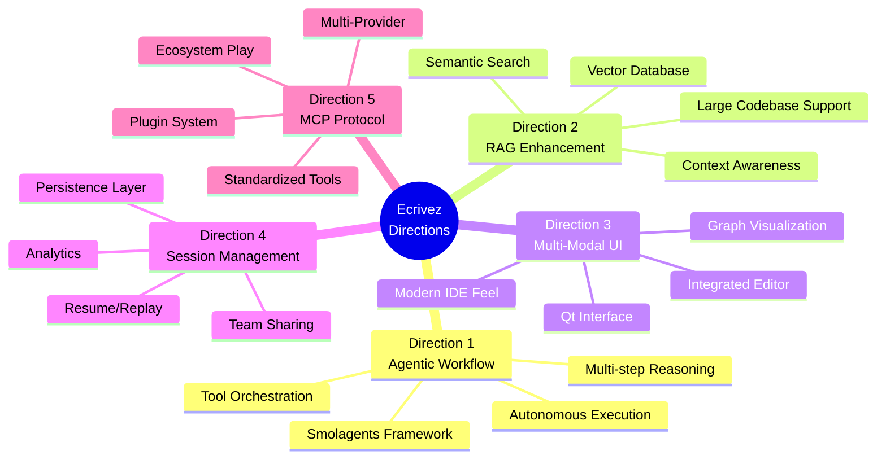
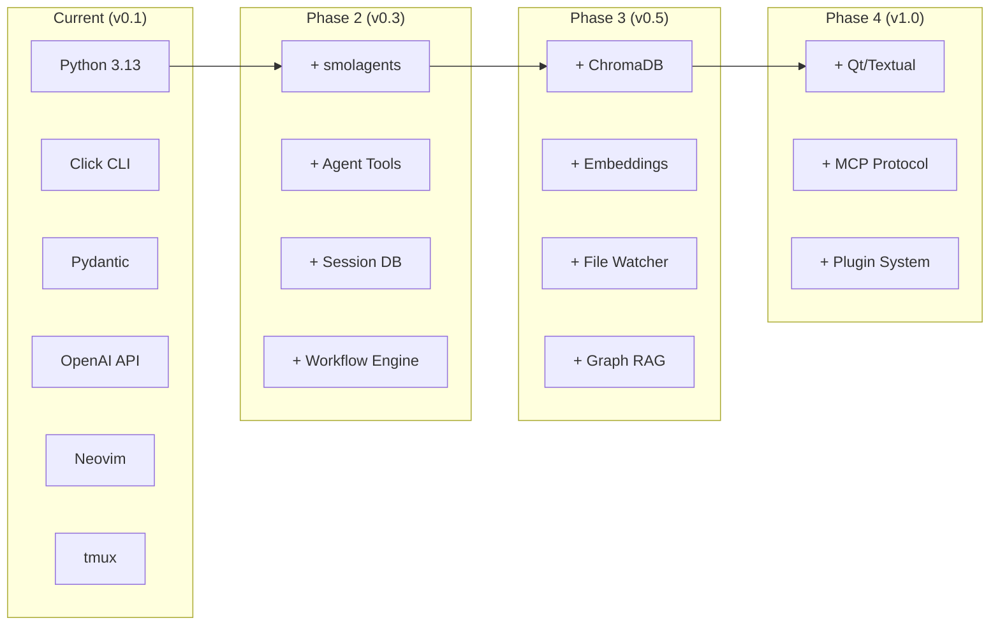
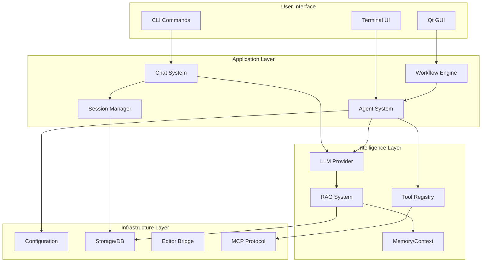
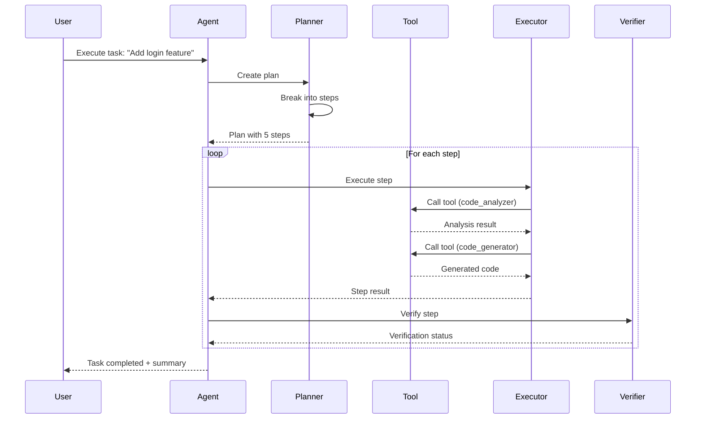
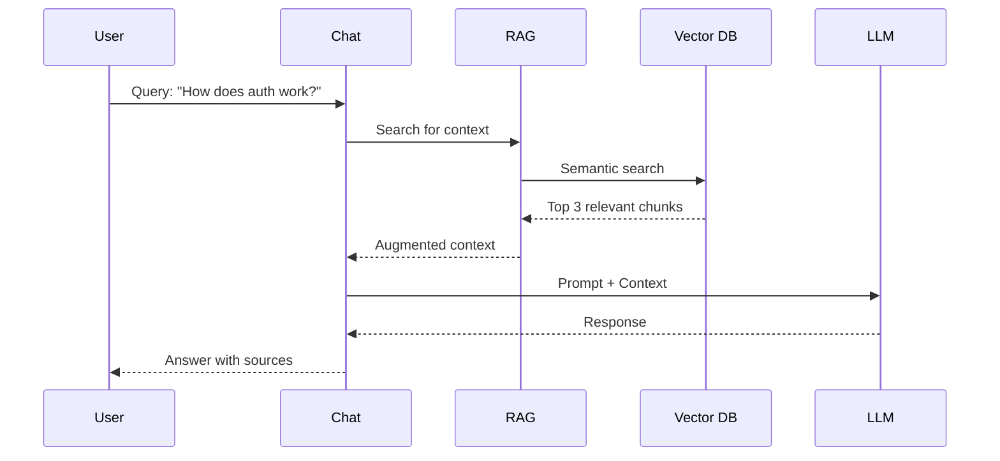
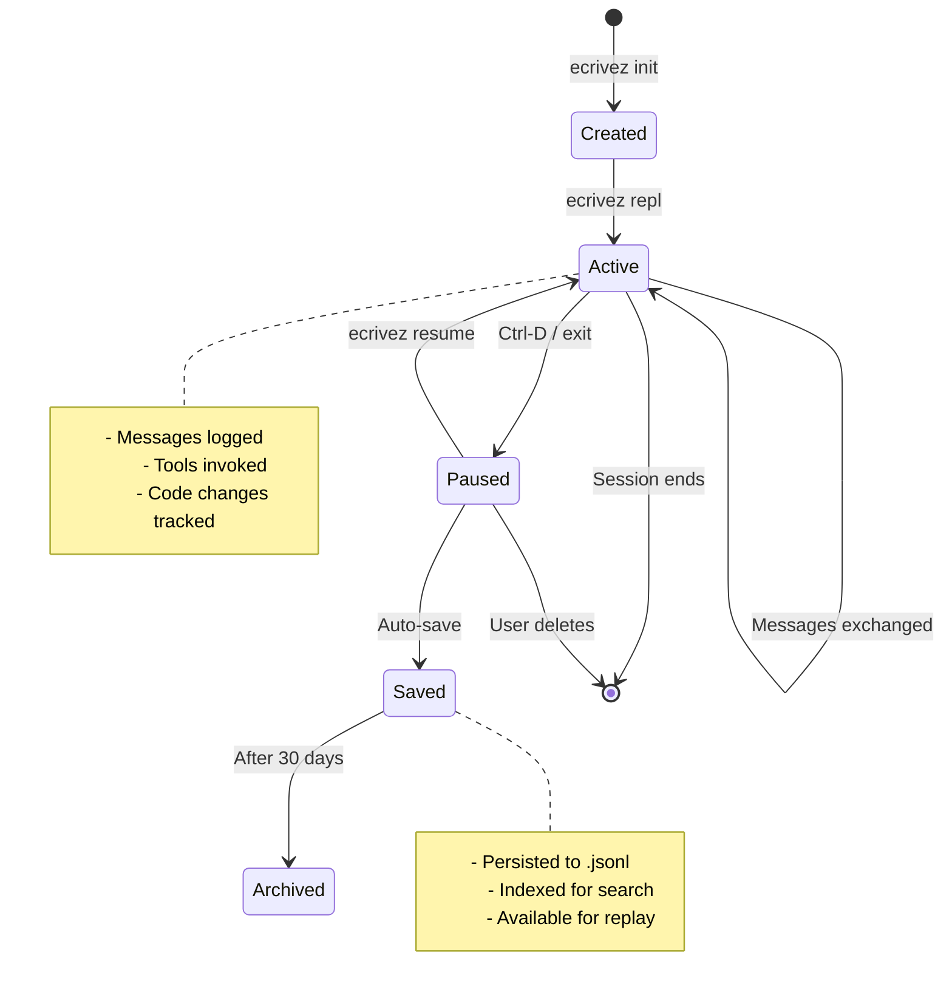
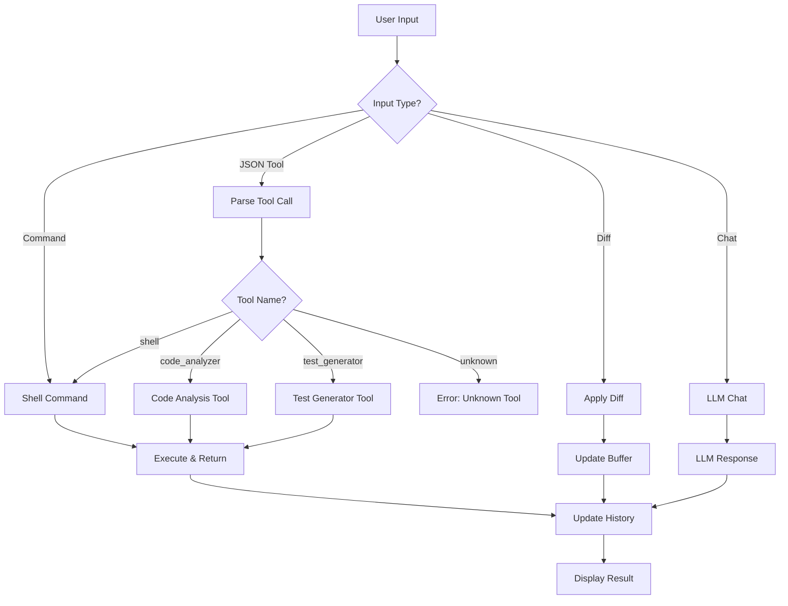
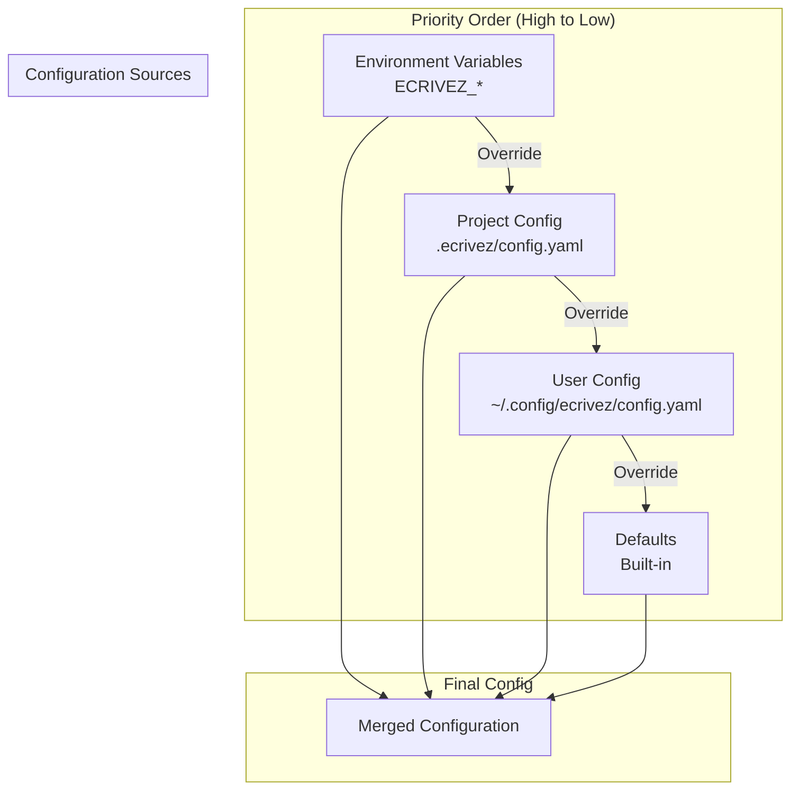
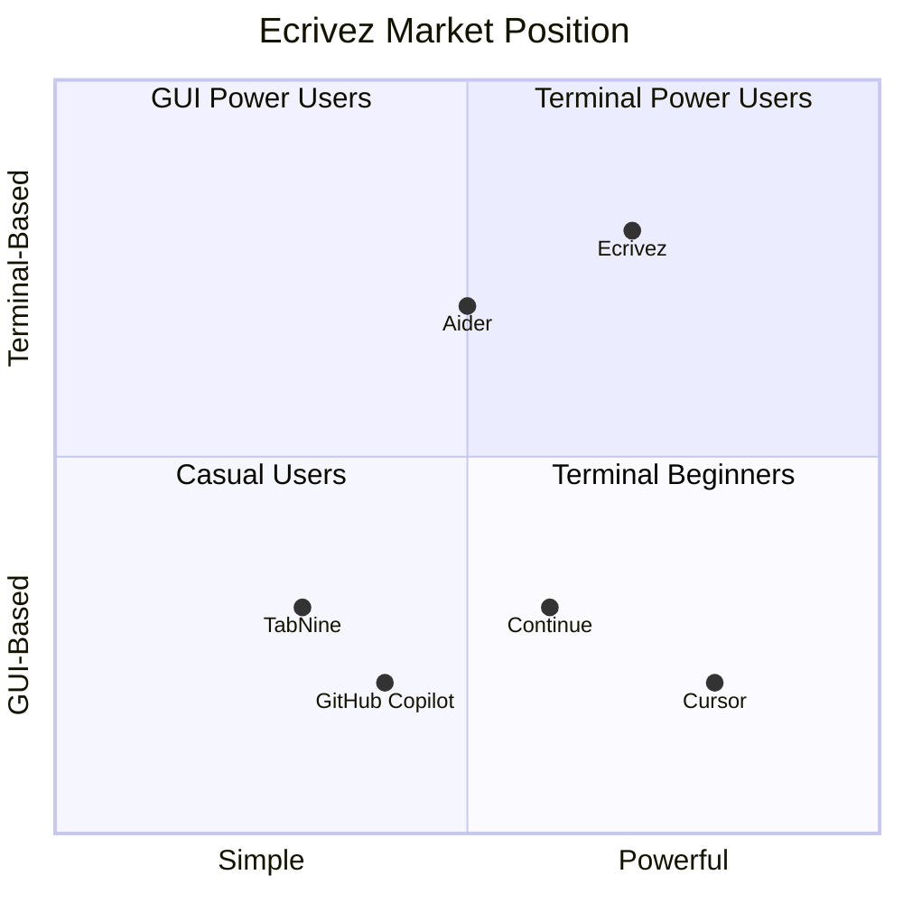
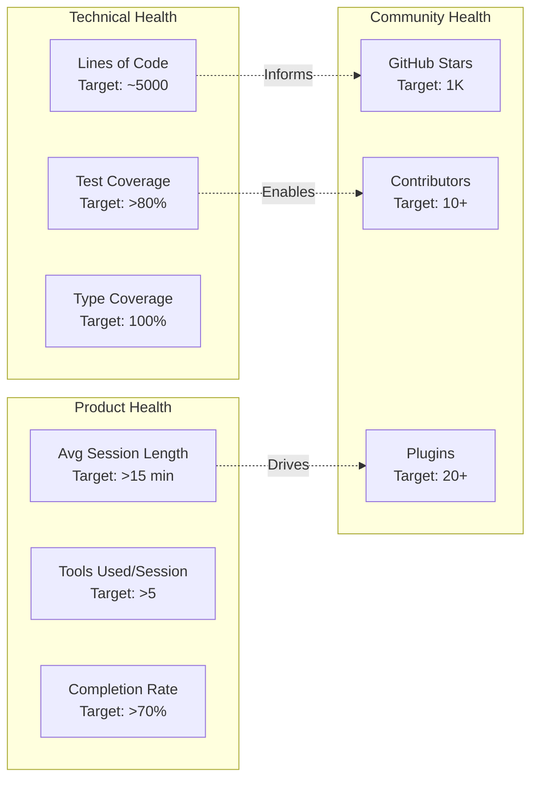

# Ecrivez Architecture & Direction Summary

## Current Architecture

```mermaid
graph TB
    subgraph "CLI Layer"
        CLI[cli.py<br/>Click Commands]
        CLI --> Init[init]
        CLI --> Config[config]
        CLI --> Chat[chat]
        CLI --> REPL[repl]
    end
    
    subgraph "Core Layer"
        Project[project.py<br/>Project Management]
        ChatCore[chat.py<br/>Chat/REPL Logic]
        Editor[editor.py<br/>Tmux Integration]
        NvimAPI[nvim_api.py<br/>Neovim Socket]
    end
    
    subgraph "Provider Layer"
        Provider[BaseProvider]
        Echo[EchoProvider]
        OpenAI[OpenAIProvider]
        Provider --> Echo
        Provider --> OpenAI
    end
    
    subgraph "Configuration"
        ConfigSystem[config/<br/>Pydantic Models]
        Paths[XDG Paths]
        Validation[Schema Validation]
    end
    
    subgraph "Tools"
        Tools[tools/<br/>Shell Runner]
    end
    
    subgraph "UI (Experimental)"
        Qt[Qt Interface]
    end
    
    Init --> Project
    REPL --> ChatCore
    Chat --> Editor
    Editor --> NvimAPI
    ChatCore --> Provider
    ChatCore --> Tools
    Project --> ConfigSystem
    ChatCore --> ConfigSystem
```

## Proposed Evolution Path

```mermaid
timeline
    title Ecrivez Development Roadmap
    
    section Phase 1: Stabilization (0-3 months)
        Fix Critical Bugs : Session persistence
                          : Diff application
                          : Complete roadmap
        Test Coverage     : Unit tests 80%+
                          : Integration tests
        Documentation     : Developer guide
                          : User tutorials
    
    section Phase 2: Intelligence (3-6 months)
        Agent Framework   : Smolagents integration
                          : Tool ecosystem
                          : Workflow definitions
        Session System    : Persistence
                          : Resume/replay
                          : Analytics
    
    section Phase 3: RAG (6-9 months)
        Code Indexing     : Vector database
                          : Semantic search
                          : Incremental updates
        Context Awareness : Augmented prompts
                          : Codebase understanding
    
    section Phase 4: Polish (9-12 months)
        UI Enhancement    : Qt interface OR
                          : TUI with textual
        MCP Integration   : Protocol support
                          : Plugin ecosystem
        Community         : Documentation site
                          : Example workflows
```

## Five Strategic Directions



## Technology Stack Evolution



## Component Dependencies



## Data Flow: Agentic Workflow



## Data Flow: RAG-Enhanced Chat



## Session Lifecycle



## Tool Invocation Flow



## Configuration Hierarchy



## Competitive Positioning



## Key Metrics Dashboard



## Decision Matrix

| Criterion | Direction 1<br/>Agents | Direction 2<br/>RAG | Direction 3<br/>UI | Direction 4<br/>Sessions | Direction 5<br/>MCP |
|-----------|:----:|:---:|:--:|:-------:|:---:|
| **Effort** (1-5) | 4 | 4 | 5 | 3 | 4 |
| **Impact** (1-5) | 5 | 4 | 3 | 4 | 3 |
| **Uniqueness** (1-5) | 4 | 3 | 2 | 5 | 3 |
| **Synergy** (1-5) | 5 | 4 | 3 | 5 | 4 |
| **Risk** (1-5) | 3 | 3 | 4 | 2 | 3 |
| **Total Score** | 21 | 18 | 17 | 19 | 17 |

**Recommended Priority:**
1. ⭐ **Direction 1 + 4** (Agents + Sessions) - Best synergy
2. 🎯 **Direction 2** (RAG) - Enhances agent capabilities
3. 🔧 **Direction 5** (MCP) - Ecosystem play
4. 💎 **Direction 3** (UI) - Polish for broader appeal

## Implementation Timeline

```
Month 1-3: Foundation 🏗️
├── Week 1-2: Bug fixes (session, diff, tests)
├── Week 3-4: Quick wins (CLI, errors, docs)
├── Week 5-8: Configuration system
└── Week 9-12: Complete roadmap milestones

Month 4-6: Intelligence 🤖
├── Week 13-16: Agent framework (smolagents)
├── Week 17-20: Tool ecosystem
├── Week 21-24: Session management
└── Deliverable: Autonomous task execution

Month 7-9: Understanding 📚
├── Week 25-28: RAG indexing
├── Week 29-32: Context-aware chat
├── Week 33-36: Graph RAG
└── Deliverable: Semantic code search

Month 10-12: Polish 💎
├── Week 37-40: UI (Qt or TUI)
├── Week 41-44: MCP integration
├── Week 45-48: Plugin ecosystem
└── Deliverable: v1.0 release
```

## Success Criteria

### Technical Excellence
- ✅ Test coverage >80%
- ✅ Type coverage 100%
- ✅ CI build time <5 min
- ✅ Response time <2 sec

### Product Success
- ✅ Active users >100/month
- ✅ Session completion >70%
- ✅ Avg session >15 min
- ✅ >5 tools used/session

### Community Growth
- ✅ GitHub stars >1K
- ✅ Contributors >10
- ✅ Plugins >20
- ✅ Documentation complete

## Resources

### Essential Reading
1. **Smolagents Docs** - Agent framework
2. **MCP Spec** - Protocol implementation
3. **Vector DB Comparison** - RAG architecture
4. **Qt/Textual Docs** - UI frameworks

### Reference Projects
1. **Aider** - Terminal-based coding assistant
2. **Cursor** - IDE with LLM integration
3. **Continue.dev** - VSCode extension pattern
4. **LangChain** - Agent orchestration

### Community
- GitHub Discussions for Q&A
- Discord for real-time chat
- Monthly community calls
- Quarterly roadmap reviews

---

*Generated: 2025-10-23*
*Status: Comprehensive Exploration Complete*
